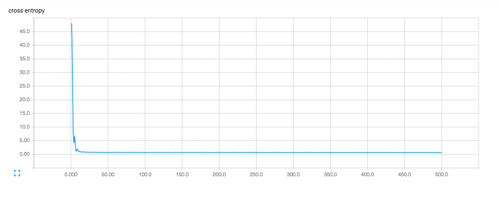

## Street Snap Image Analysis

### 1.Gender Classifier

#### Classes
- 0 : Female
- 1 : Male

#### Model

1. **AlexNet** [paper](https://papers.nips.cc/paper/4824-imagenet-classification-with-deep-convolutional-neural-networks.pdf)

	##### Event

	- Accuracy

	

	- Loss

	

	AlexNet is not enough!

2. **VGG**

	##### Event

	- Accuracy

	

	- Loss

	

### 2.Category Classifier

#### Classes
- 0 : Street
- 1 : Casual
- 2 : Sexy
- 3 : Unique
- 4 : Work wear
- 5 : Classic

1. **VGG**

	##### Event

	- Accuracy

	

	- Loss

	

